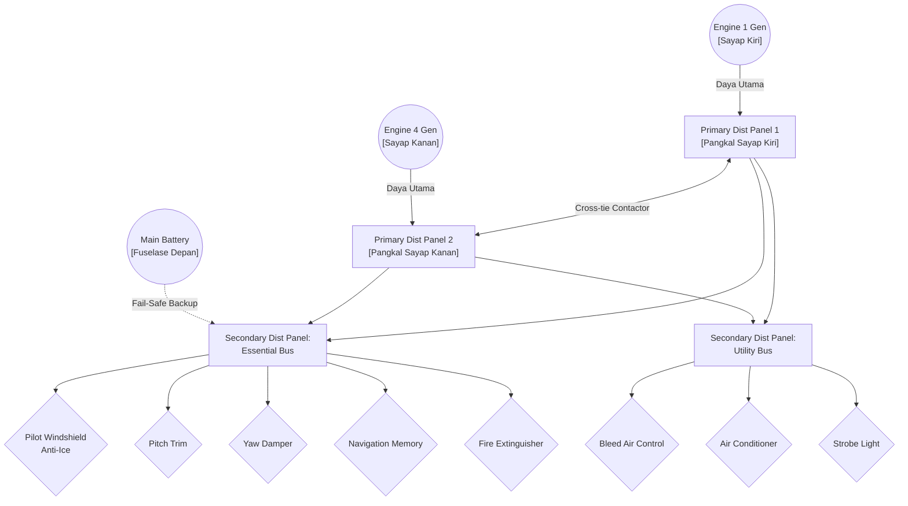

```mermaid
graph TD
    %% Power Sources (Circles/Ellipses)
    Gen1(("Engine 1 Gen<br>[Sayap Kiri]"))
    Gen4(("Engine 4 Gen<br>[Sayap Kanan]"))
    Bat(("Main Battery<br>[Fuselase Depan]"))

    %% Primary & Secondary Panels (Rectangles)
    PDP1["Primary Dist Panel 1<br>[Pangkal Sayap Kiri]"]
    PDP2["Primary Dist Panel 2<br>[Pangkal Sayap Kanan]"]
    SDP_Ess["Secondary Dist Panel:<br>Essential Bus"]
    SDP_Util["Secondary Dist Panel:<br>Utility Bus"]

    %% Critical Flight Systems (Diamonds)
    Sys_Ice{"Pilot Windshield<br>Anti-Ice"}
    Sys_Pitch{"Pitch Trim"}
    Sys_Yaw{"Yaw Damper"}
    Sys_Nav{"Navigation Memory"}
    Sys_Fire{"Fire Extinguisher"}

    %% Utility & Environmental Systems (Diamonds)
    Sys_Bleed{"Bleed Air Control"}
    Sys_AC{"Air Conditioner"}
    Sys_Strobe{"Strobe Light"}

    %% Routing - Solid Lines (Primary)
    Gen1 -->|"Daya Utama"| PDP1
    Gen4 -->|"Daya Utama"| PDP2
    
    PDP1 <-->|"Cross-tie Contactor"| PDP2

    PDP1 --> SDP_Ess
    PDP1 --> SDP_Util
    PDP2 --> SDP_Ess
    PDP2 --> SDP_Util

    %% Routing - Dashed Lines (Secondary/Backup)
    Bat -.->|"Fail-Safe Backup"| SDP_Ess

    %% Load Connections
    SDP_Ess --> Sys_Ice
    SDP_Ess --> Sys_Pitch
    SDP_Ess --> Sys_Yaw
    SDP_Ess --> Sys_Nav
    SDP_Ess --> Sys_Fire

    SDP_Util --> Sys_Bleed
    SDP_Util --> Sys_AC
    SDP_Util --> Sys_Strobe
```
